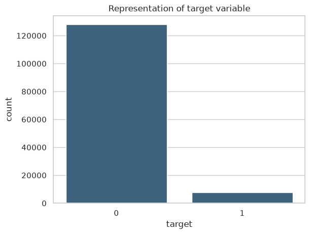
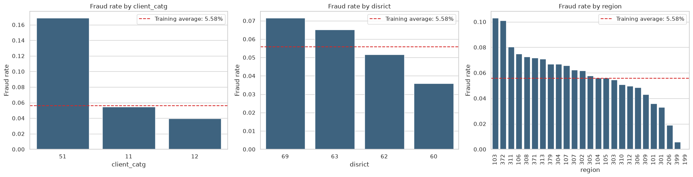
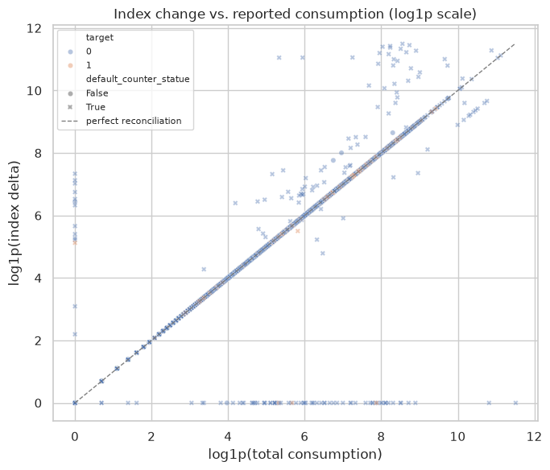
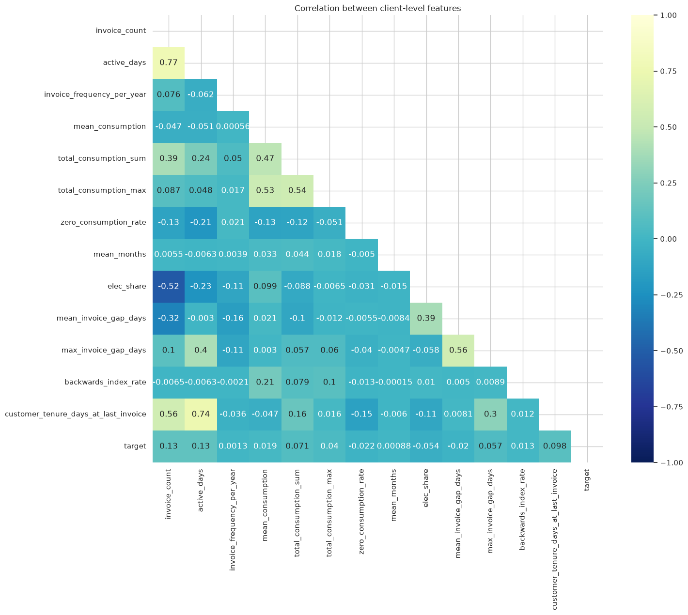
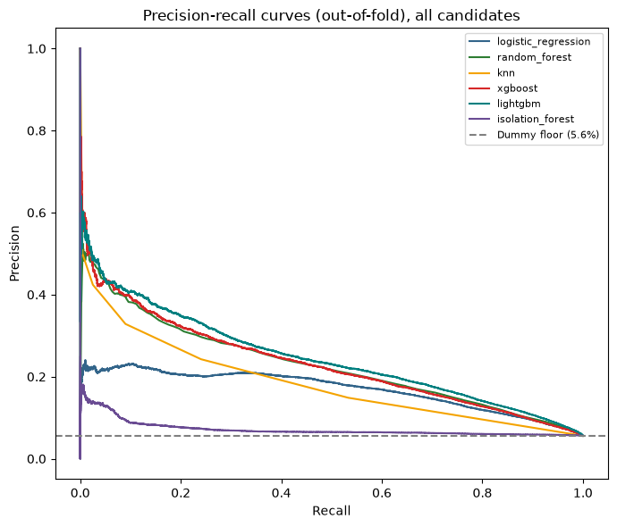
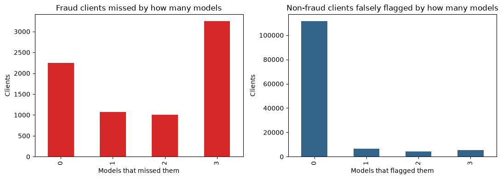
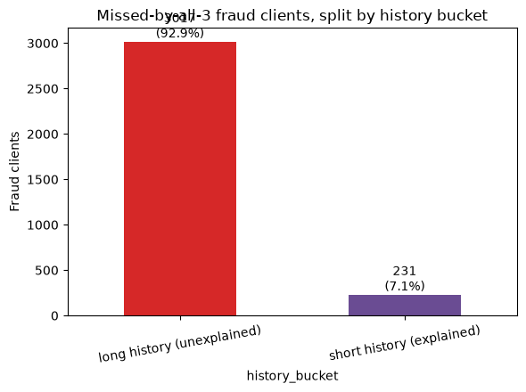
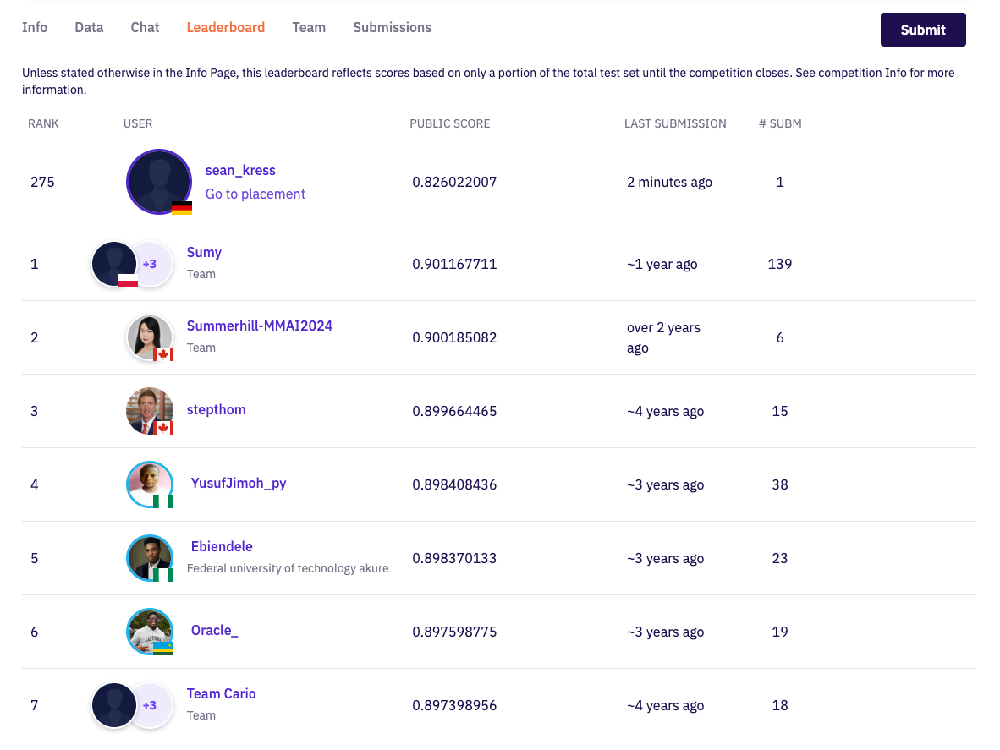

# Fraud detection in electricity and gas consumption — data-science presentation

This Markdown file is the content blueprint for the final presentation. It keeps the project story, evidence, decisions, and notebook visuals in one readable place. Transitional questions and thank-you slides are intentionally omitted.

## Slide 1 — Title

**Predicting which electricity and gas clients should be inspected first**

Fraud detection as a ranking problem  
Roy Grossman · Sean Kress

**Opening:** We built an end-to-end supervised-learning workflow that converts 4.48 million invoice rows into a ranked list of 135,493 clients. The model supports investigation prioritisation; it does not prove fraud.

## Slide 2 — Today’s route

1. **Problem and value:** business case, metric choice, and evaluation design.
2. **Data and EDA:** aggregation, feature contract, patterns, and bias.
3. **Modelling:** pipeline, baseline, model comparison, error analysis, and final model.
4. **Recommendation:** intended use, operating controls, and limitations.
5. **Next steps:** roadmap and engineering work.

## Slide 3 — Business case

A utility cannot investigate every client. The operational decision is therefore not “fraud or not fraud for everyone,” but:

> Which clients should enter the limited inspection queue first?

The model outputs a risk score for each client. Investigators choose a capacity-based cut-off, review the highest-scoring clients, and return outcomes that can later improve the model.

**Data-science consequence:** this is primarily a ranking and resource-allocation problem, not a default-threshold classification problem.

## Slide 4 — What does value mean?

- **135,493 labelled clients**; **7,566 fraud cases**; fraud prevalence **5.58%**.
- A constant “not fraud” prediction is about 94% accurate and operationally useless.
- **Primary selection metric:** average precision / PR-AUC, because it evaluates the ranking under class imbalance.
- **Operating-point metrics:** precision@10% and recall@10%, because the inspection team has limited capacity.
- **Secondary diagnostic:** ROC-AUC, useful for ranking comparison but too optimistic as a headline metric on rare classes.

**Decision rule:** select the model by out-of-fold PR-AUC, then choose the inspection cut-off using capacity, false-positive cost, and missed-fraud cost.

**Visual from `01_eda.ipynb`: target balance**

## Slide 5 — Our data-science question

> Can client and invoice history produce a useful ranking, and where does that ranking fail?

Evaluation design:

1. Build one client-level feature table from the raw client and invoice tables.
2. Compare models using five-fold stratified out-of-fold predictions.
3. Tune the best candidate only on the development partition.
4. Freeze the pipeline and score the final in-memory holdout once.

**Important limitation:** EDA used all labelled clients before the final in-memory split. The holdout supports this challenge result, but it is not a fully independent production estimate.

## Slide 6 — The conclusion first

**Recommendation:** use tuned LightGBM with native categorical handling to rank clients for human inspection.

Why:

- Final holdout **PR-AUC 0.2647**, compared with a prevalence/dummy reference near **0.056**.
- Final holdout **ROC-AUC 0.8354** confirms useful ordering, but not perfect separation.
- The ensemble was rejected: LightGBM alone scored **0.2506** out-of-fold versus **0.2499** for LightGBM + Random Forest.
- All three top models miss many of the same fraud clients, suggesting that the current features lack useful information for those cases. Recall@10% is only **5.6%** for the shortest-history clients and also varies strongly by region.

The rest of the deck explains the data contract, model evidence, and limitations behind this decision.

## Slide 7 — EDA: from invoices to one prediction row per client

Two source grains had to become one modelling grain:

- `client_train`: **135,493 rows**, one row and one target per client.
- `invoice_train`: **4,476,749 rows**, repeated billing and meter history.
- Average exposure: about **33 invoice rows per client**, with a wide history range.
- Output: `df_training.csv`, **135,493 rows × 17 columns** — `client_id`, `target`, and 15 predictors.

The aggregation is chunked to avoid loading the complete invoice table into browser memory. The raw source tables contain no missing cells.

**Observation-window bias:** fraud rate rises from **0.94%** for clients with 1–7 invoices to **9.15%** for clients with 58 or more. The model may partly learn how much history is available rather than fraud behaviour alone. Later evaluation must therefore compare performance across history-length groups.

## Slide 8 — EDA: the feature contract we built

The baseline contract deliberately stays small: **12 numeric signals + 3 categorical context fields**.

| Signal family | Inputs | Why it exists |
|---|---|---|
| Observation history | `invoice_count`, `active_days`, `mean_invoice_gap_days` | Amount and regularity of evidence available for a client |
| Consumption | `mean_consumption`, `zero_consumption_rate`, `elec_share` | Typical demand, zero readings, and energy mix |
| Meter sequence | `backwards_index_rate`, `meter_count`, `mean_monthly_submission_index_delta`, `backward_submission_rate` | Resets/corrections, meter complexity, and changes across ordered readings |
| Reconciliation | `large_mismatch_count`, `reconciliation_gap_abs_mean` | Difference between meter-index movement and billed consumption |
| Client context | `client_catg`, `disrict`, `region` | Segment and geographic base-rate variation; treated as categories, not quantities |

The contract is explicit so every model receives the same client information and future data can be transformed consistently. `disrict` is the spelling used in the source data.

## Slide 9 — EDA: strong patterns and bias risks

Three findings changed the modelling plan:

1. **Observation-window signal:** fraud rate rises from **0.94%** for clients with 1–7 invoices to **9.15%** for clients with 58–439 invoices — a **9.7×** range. History length is predictive, but also a bias risk.
2. **Categorical signal:** `client_catg == 51` has **16.87% fraud**, versus the overall **5.58%**. Region and district also show material base-rate differences.
3. **Reconciliation signal:** mean absolute meter/consumption gap is **118.5 for fraud** versus **75.4 for non-fraud**, while the median is zero in both groups. The difference is concentrated in a subset of clients.

No numeric feature is individually decisive: the largest linear target correlations are only **0.128** for `active_days` and **0.127** for `invoice_count`. This supports combining signals and testing non-linear models.

**Visual from `01_eda.ipynb`: categorical fraud patterns**

The categorical plots show that client segment and geography carry different fraud base rates. They are useful context signals, but they also require segment-level monitoring so that the model does not silently favour well-represented groups.

**Visual from `01_eda.ipynb`: meter and consumption reconciliation**

The reconciliation view tests whether changes in submitted meter readings agree with reported consumption. Large disagreements are uncommon, but they are more pronounced for part of the fraud-labelled population.

## Slide 10 — EDA conclusion: what changes for modelling?

EDA changed three parts of the modelling plan:

| Decision | What it means |
|---|---|
| **Model now** | Use 15 client inputs covering history, consumption, meter sequence, reconciliation, client category, district, and region. |
| **Control for** | Report results by history length and geography, and avoid conclusions based on unreliable creation dates. |
| **Investigate next** | Build stronger short-history signals and validate meter resets and reconciliation gaps with domain experts. |

The first model therefore uses one explicit 15-input contract rather than every available aggregate. Unusual readings remain available as possible signals; rows are not deleted without evidence.

**Visual from `01_eda.ipynb`: feature correlations**

The correlation plot supports the smaller feature contract. Some inputs describe overlapping ideas—especially the amount of client history—but no pair alone explains fraud and no automatic correlation-based deletion rule was used.

## Slide 11 — Reproducible modelling pipeline

The implementation separates deterministic feature creation from learned preprocessing:

`raw client + invoice Parquet → client aggregation → 15-column contract → fold-local preprocessing → estimator → probability ranking`

- Numeric inputs: median imputation; scaling for models that benefit from it.
- Categorical inputs: one-hot encoding with unknown-category handling for the common comparison pipeline.
- Final LightGBM: median-imputed numeric inputs plus native categorical handling.
- Cross-validation: preprocessing is fitted inside each training fold.
- Reusable feature creation: applies the same client-feature calculations to future raw data; it does **not** contain the fraud estimator.

## Slide 12 — Baseline model and results

The simple baseline tests whether the 15 inputs contain learnable signal before adding model complexity.

| Model | Five-fold PR-AUC | ROC-AUC |
|---|---:|---:|
| Dummy classifier | 0.056 | 0.502 |
| Regularised logistic regression | **0.170** | **0.795** |

Logistic regression triples PR-AUC over the prevalence-level reference. The features are useful, but the linear decision surface leaves substantial room for non-linear interactions.

## Slide 13 — Model extensions and results

Every candidate uses the same 15-input contract and five-fold stratified comparison.

| Model | PR-AUC | ROC-AUC |
|---|---:|---:|
| LightGBM | **0.247** | **0.831** |
| XGBoost | 0.232 | 0.812 |
| Random Forest | 0.227 | 0.816 |
| Logistic Regression | 0.170 | 0.795 |
| KNN | 0.139 | 0.687 |
| Isolation Forest | 0.072 | 0.560 |
| Dummy | 0.056 | 0.502 |

LightGBM earns the tuning budget. The result also shows that non-linear tree models capture structure that the linear baseline misses.

**Visual from `03_model_extension.ipynb`: model comparison**

The precision-recall curves make the comparison visible across thresholds rather than at one arbitrary cut-off. LightGBM stays above the other candidates through most of the useful recall range.

## Slide 14 — Error analysis: where the models fail

At a top-10% inspection capacity, compare LightGBM, XGBoost, and Random Forest on all 7,566 fraud clients:

- **2,250** caught by all three models.
- **1,066** missed by one model.
- **1,002** missed by two models.
- **3,248** missed by all three models.

The unanimous-miss group is **42.9% of all fraud clients**. This high overlap explains why a simple ensemble adds little.

The holdout confirms a data-availability blind spot: recall@10% rises from **5.6%** in the shortest invoice-history quintile to **55.9%** in the longest. Region recall also ranges from **19.9%** in region 104 to **68.2%** in region 311.

**Visual from `04_error_analysis.ipynb`: model agreement**

Here, **0 models missing a client** means all three models caught that fraud case; **3 models missing a client** means every leading model missed it. The large final group points to a shared feature limitation, not just a weak choice of algorithm.

**Visual from `04_error_analysis.ipynb`: shared misses by history length**

The missed-history split connects the shared errors to evidence availability: clients with limited history give every model less behaviour to learn from.

## Slide 15 — Final tuned model

Tuning decision:

- Randomised search with five-fold average precision.
- Native categorical LightGBM search score: **0.2514 PR-AUC**.
- One-hot LightGBM search score: **0.2470 PR-AUC**.
- Recomputed tuned LightGBM out-of-fold score: **0.2506 PR-AUC**, **0.8250 ROC-AUC**.
- Soft LightGBM + Random Forest ensemble: **0.2499 PR-AUC** — rejected because it is more complex and slightly worse.

Frozen-model result on the one-time in-memory holdout:

- **PR-AUC 0.2647**
- **ROC-AUC 0.8354**

Tuning improves the model modestly; it does not solve the short-history feature gap.

**Visual from `05_final_model.ipynb`: holdout recall by history length**

This final holdout check confirms the bias found during EDA: recall increases sharply as more invoice history becomes available. The production recommendation therefore includes monitoring by history length.

## Slide 16 — One illustrative example — not a recommendation

To make the operating trade-off concrete, use a **top-10% threshold only as an example**:

- Flag **2,710 of 27,099** holdout clients.
- Catch **702 of 1,513** fraud clients: **46.4% recall**.
- Miss **811** fraud clients.
- Produce **2,008** false alarms: **25.9% precision**, so 74.1% of flagged clients are not fraud.
- The flagged group is still **4.6 times more fraud-concentrated** than the full client population.

This is not a recommended production threshold. The real cut-off must follow investigation capacity and the relative cost of false alarms versus missed fraud.

## Slide 17 — Zindi submission: a credible first result

The first submitted model achieved:

- **Public rank 275 of 710 rated participants** — approximately the top 39%.
- **Public score 0.826022007**.
- **One submission** at the time of capture.

This is an external sanity check, not a direct comparison with local PR-AUC. Zindi’s public score uses the competition evaluation and only part of the test set until final ranking.

**Visual evidence: public leaderboard result**

## Slide 18 — Recommendation

Deploy the tuned LightGBM only as a **ranking aid** for investigators.

Required operating controls:

- Select the threshold from actual inspection capacity and error costs.
- Keep a human decision between model score and fraud action.
- Monitor precision and recall by history length, region, district, and client category.
- Record investigation outcomes for calibration, drift checks, and retraining.
- Do not interpret high feature importance or a high score as causal evidence of fraud.

## Slide 19 — Extra / bonus: reproducibility and CI/CD

Engineering work completed alongside modelling:

- Separate lifecycle notebooks: EDA, baseline, model extension, error analysis, and final model.
- Memory-aware CSV-to-Parquet conversion and chunked invoice aggregation.
- Explicit 15-feature contract and reusable feature-engineering pipeline.
- `uv.lock` and `pyproject.toml` for dependency reproducibility.
- Pinned Jupyter Docker image for local parity.
- GitHub Actions executes the EDA and baseline notebooks on pull requests and `main`.

The project shows our full process: from raw data and feature creation to model comparison, error analysis, and a practical recommendation.

## Slide 20 — Next steps

1. **Temporal validation:** train on earlier invoices and test on later clients/events using a defensible label timestamp.
2. **Short-history features:** ratios, recency, early-life patterns, and sequence features that do not require many invoices.
3. **Domain validation:** confirm the interpretation and threshold of meter/consumption reconciliation gaps.
4. **Operating point:** estimate investigation capacity and costs, then choose and calibrate a threshold.
5. **Segment robustness:** define minimum performance and sample-size rules for geography and client categories.
6. **Production contract:** test the raw-data transformer, schema checks, model artifact, and monitoring as one versioned unit.
