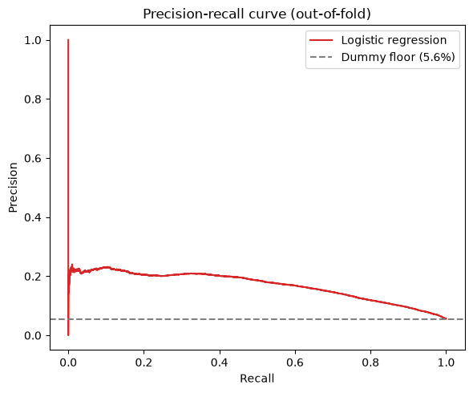
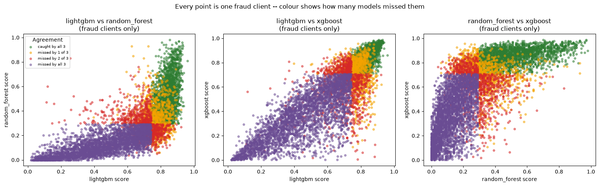
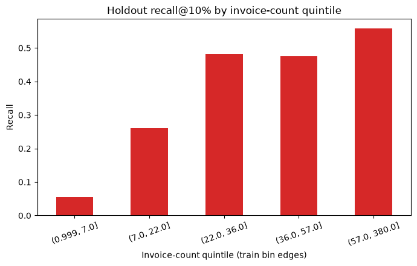

# Fraud detection in electricity and gas consumption

## Presentation blueprint

This is the detailed speaking plan for the PowerPoint deck. Keep one main message per slide. The text here is more detailed than the final slides so Roy and Sean can choose what to say. Use the notebook tables and charts as the source of truth when a notebook is rerun.

## Slide 1 — Title

**Predicting which electricity and gas clients should be inspected first**

- Team: Roy and Sean
- Dataset: labelled electricity and gas consumption clients
- Goal: rank clients by fraud risk so a limited inspection team can start with the most promising cases
- Repository: link to the GitHub project

**Visual:** simple client → meter → invoice illustration.

**Say:** “We are not trying to prove fraud automatically. We are building a ranking tool to help decide who should be inspected first.”

## Slide 2 — Business case

A utility company cannot inspect every client. The practical question is:

> If the team can inspect only a limited number of clients, which clients should it inspect first?

The business value is finding more real fraud cases within the available inspection capacity while avoiding unnecessary investigations of non-fraud clients.

**Visual:** a funnel from all clients to a small inspection queue.

## Slide 3 — What does value mean?

The target is highly imbalanced:

- 135,493 labelled clients
- 7,566 fraud clients (**5.58%**)
- 127,927 non-fraud clients

Accuracy is not the main measure. Predicting “not fraud” for everybody would be about 94% accurate but would find no fraud.

**Primary metric:** average precision / PR-AUC, because it evaluates ranking quality when fraud is rare.

**Operational metrics:** precision and recall at a chosen inspection capacity, such as the top 10% of clients. The final threshold should be chosen with the inspection team, using the cost of missed fraud and unnecessary inspections.

**Say:** “Precision tells us how many flagged clients are actually fraud. Recall tells us how much of all fraud we found.”

## Slide 4 — Our data-science question

We followed the lifecycle:

1. Understand the client and invoice tables.
2. Check data quality and unusual readings.
3. Aggregate invoices into one row per client.
4. Select a small, explainable feature contract.
5. Compare a simple baseline with stronger model families.
6. Analyse where the models fail.
7. Tune one candidate and evaluate it once on a final in-memory holdout.

**Project decision:** is the current information sufficient to produce a useful inspection ranking, and which weaknesses must be addressed before deployment?

## Slide 5 — EDA: from invoices to one prediction row per client

- `client_train.parquet`: one row per labelled client and the target.
- `invoice_train.parquet`: 4,476,749 invoice rows belonging to those clients.
- The relationship is one client to many invoices; the target exists once per client.
- Invoice rows were processed in chunks to keep memory use manageable.
- Dates, consumption, meter readings, invoice gaps, and reconciliation measures were aggregated to one row per client.
- The EDA output is the complete `data/processed/df_training.csv` table: one row per labelled client.
- The raw source tables have no missing cells. Two derived meter-transition features are unavailable for **5,333 clients** because there is no usable positive-day transition; modelling handles those values with training-data median imputation.

**Visual:** `client → many invoices → client-level feature row → model score`.

**Important evaluation fact:** 01 does not split the data. The modelling notebooks use the complete client-level table for five-fold cross-validation; 05 creates its final holdout in memory.

## Slide 6 — EDA: features created and prepared

The target is in `client_train`; repeated behaviour is in `invoice_train`. Every created feature is aggregated to one row per client before modelling.

| Inputs | Origin | Why created/prepared | Evidence and modelling decision |
|---|---|---|---|
| `invoice_count`, `active_days` | Created from invoice dates | Represent the amount and duration of recorded history rather than hiding exposure inside totals | Fraud medians: **41 vs 29 invoices** and **4,727 vs 3,283 active days**. Keep both, while testing observation-window bias. |
| `mean_consumption`, `zero_consumption_rate`, `elec_share` | Created from consumption and meter type | Compare typical usage, repeated zero readings, and electricity/gas mix across clients with different history lengths | Fraud median mean consumption: **466 vs 393**. Keep all three. |
| `mean_invoice_gap_days` | Created from invoice dates | Describe regularity and pauses that count and active days do not show | No strong standalone fraud-rate result. Keep the mean gap; postpone the outlier-sensitive maximum. |
| `backwards_index_rate` | Created from `new_index - old_index` | Preserve possible corrections, resets, or unusual meter behaviour without deleting rows | At least one backward index: **11.34% fraud vs 5.51% without one**. Keep as a candidate signal, not proof. |
| `meter_count`, `mean_monthly_submission_index_delta`, `backward_submission_rate` | Created from meter identifiers, indices, and invoice dates | Compare consecutive readings for the same recorded meter and adjust changes for unequal time gaps | Backward submission rate: **11.94% vs 8.82%**. **5,333 clients** have no usable transition, so the two transition features are median-imputed during modelling. Keep these three; postpone transition count because it mainly reflects history length. |
| `large_mismatch_count`, `reconciliation_gap_abs_mean` | Created by comparing index change with summed consumption | Test whether meter movement and billed consumption disagree | At least one large mismatch: **8.82% fraud vs 5.52% non-fraud**. Keep as candidate checks; threshold needs domain validation. |
| `client_catg`, `disrict`, `region` | Original fields from `client_train`, prepared as categories | These are labels, not continuous measurements; one-hot/native categorical handling avoids false numeric distances | Category 51: **16.87% fraud**; region 103: **10.30%**; keep all three as categorical inputs. |

**Say:** “The raw data tells us what was billed. These features describe history, behaviour, regularity, and consistency.”

## Slide 7 — EDA: strong patterns and bias risks

### Strong patterns

- Fraud rate rises from **0.94%** in the 1–7 invoice group to **9.15%** in the longest-history group.
- Category 51 has **16.87% fraud**, roughly three times the overall base rate.
- A backward meter index is associated with **11.34% fraud**, compared with **5.51%** without one.
- The highest monthly meter-change group has **7.39% fraud**, compared with **3.75%** in the lowest group.
- A large index-versus-consumption mismatch appears for **8.82% of fraud clients** and **5.52% of non-fraud clients**.

### Named risks

- **Observation-window bias:** clients observed for longer have more invoices and more opportunities for fraud to be detected. The model may learn “long-known client” rather than behaviour that generalises to a newly observed client.
- **Inspection/label bias:** category and regional differences may partly reflect where inspections were historically concentrated.
- **Temporal/cohort risk:** invoice coverage changes strongly over calendar time. A random client split does not test future-time performance.
- **Leakage risk:** last-invoice `reading_remarque` and `counter_statue` may reflect later investigation or account events, so they are excluded.

**Visual:** compact findings table with the 5.58% base rate as a reference.

## Slide 8 — EDA conclusion: the 15 client inputs

The baseline uses **12 created numeric features plus 3 original categorical fields**.

| Group | Final inputs | Origin |
|---|---|---|
| Client category and geography | `client_catg`, `disrict`, `region` | Original `client_train` fields, prepared as categories |
| History and timing | `invoice_count`, `active_days`, `mean_invoice_gap_days` | Created from invoice dates |
| Consumption | `mean_consumption`, `zero_consumption_rate`, `elec_share` | Created from invoice consumption and meter type |
| Meter behaviour | `backwards_index_rate`, `meter_count`, `mean_monthly_submission_index_delta`, `backward_submission_rate` | Created from meter identifiers, indices, and invoice dates |
| Reconciliation | `large_mismatch_count`, `reconciliation_gap_abs_mean` | Created from meter-index changes and summed consumption |

Before modelling:

- We keep all raw invoice rows; we do not automatically delete the 11 duplicate-looking rows or backward readings.
- We do not fill missing values in the EDA. The raw tables have no missing cells, but the two derived meter-transition features are missing for **5,333 clients**; the modelling pipeline median-imputes those values using each training fold only.
- We exclude `client_id`, `target`, raw dates, unreliable tenure, `months_number` features, split labels, and possible last-invoice leakage fields.
- Features left out initially are postponed, not permanently deleted.

**Handoff:** `client_train + invoice_train → one row per client → 15 inputs → df_training.csv → modelling`.

## Slide 9 — Reproducible modelling pipeline

- 01 creates the complete `df_training.csv` and the reusable feature-engineering pipeline.
- The pipeline can rebuild the client-level features from raw client/invoice data and then apply the learned preprocessing.
- Numeric model inputs are median-imputed and scaled.
- Categorical inputs are encoded consistently; unknown future categories are ignored safely.
- 02, 03, and 04 use five-fold stratified cross-validation on the complete client-level table.
- 05 creates `development_data` and `final_holdout` in memory from `df_training.csv`. It does not read or write a separate test CSV.
- The final holdout is scored once after model decisions are frozen.

**Visual:** `raw files → feature builder → 15 inputs → preprocessing → CV/model → one-time holdout`.

## Slide 10 — Baseline model and results

We started with a deliberately simple reference: a stratified dummy classifier and regularised logistic regression.

| Model | Five-fold PR-AUC | ROC-AUC |
|---|---:|---:|
| Dummy classifier | **0.056** | **0.502** |
| Logistic regression | **0.170** | **0.795** |

Interpretation:

- Logistic regression is clearly better than the dummy ranking, so the selected features contain useful signal.
- PR-AUC is still far below 1.0, so this is a ranking problem with substantial overlap between fraud and non-fraud clients.
- This baseline is explainable and gives the stronger model families a fair reference.

**Visual:** precision-recall curve from the baseline notebook.

## Slide 11 — Model extensions and results

We compared linear, distance-based, tree, and anomaly-detection approaches using the same 15-input contract and five-fold CV.

| Model | PR-AUC | ROC-AUC | Decision |
|---|---:|---:|---|
| LightGBM | **0.247** | **0.831** | Leading untuned candidate |
| XGBoost | 0.232 | 0.812 | Useful reference, behind LightGBM |
| Random Forest | 0.227 | 0.816 | Useful reference, behind LightGBM |
| Logistic regression | 0.170 | 0.795 | Simple baseline |
| KNN | 0.139 | 0.687 | Weaker ranking |
| Isolation Forest | 0.072 | 0.560 | Close to the dummy reference |

**Decision:** continue with LightGBM for tuning. The gain comes from modelling non-linear combinations of history, category, meter, and consumption features—not from one single feature.

## Slide 12 — Error analysis: where the models fail

The three tree models agree strongly:

- **3,248 fraud clients (42.9% of all fraud)** were missed by all three models.
- **2,250 fraud clients** were caught by all three.
- The remaining fraud clients were split between partial agreement groups.
- The shortest-history group (1–7 invoices) has only **2.3% LightGBM recall**, **5.8% Random Forest recall**, and **6.2% XGBoost recall** in the top-10% inspection analysis.
- Among long-history fraud clients, **3,017** were still missed by every model; this is not explained by short history alone.
- The current feature comparison among that long-history missed group shows the largest median difference for `mean_invoice_gap_days` (effect size **−0.20**), but this is exploratory, not causal evidence.

**Message:** changing model family alone will not solve the main blind spot. We need better signal for short-history and consistently missed clients.

## Slide 13 — Final tuned model

We tuned LightGBM and compared one-hot preprocessing with native categorical handling.

| Candidate | Development CV PR-AUC |
|---|---:|
| Untuned LightGBM | **0.2379** |
| Tuned LightGBM, one-hot | **0.2470** |
| Tuned LightGBM, native categorical | **0.2514** during tuning; **0.2506** OOF comparison |
| Tuned LightGBM + Random Forest ensemble | **0.2499** |

**Decision:** keep tuned LightGBM with native categorical handling. The ensemble was rejected because it was slightly worse and did not justify extra complexity.

**One-time in-memory holdout:** PR-AUC **0.2647**, ROC-AUC **0.8354**.

**Caveat:** this final holdout is a useful final check created from `df_training.csv`, but it is not the separate unlabelled Kaggle test set and should not be reused for repeated tuning.

## Slide 14 — Recommendation

Use the tuned LightGBM as a ranking aid for inspection prioritisation, not as an automatic fraud verdict.

The model has useful lift over the baseline, but the error analysis identifies important limits:

- It performs poorly for clients with very short invoice histories.
- Regional performance is uneven: holdout recall was **19.9% in region 104**, **29.1% in region 107**, and **68.2% in region 311** at the same inspection rule.
- A strong overall metric can hide weak performance in specific client groups.
- Human review and a capacity-based threshold remain necessary.

## Slide 15 — Next steps

1. Define the real inspection capacity and the cost of false positives versus missed fraud.
2. Evaluate precision and recall at that business threshold, not only PR-AUC.
3. Add features that describe short-history clients without relying on future investigation events.
4. Validate meter identifiers and the reconciliation threshold with domain experts.
5. Test temporal backtesting: train on earlier observations and evaluate on later ones.
6. Recheck regional and category performance before deployment.
7. Keep the final holdout untouched until the feature contract and threshold are fixed.

## Slide 16 — Extra / bonus: reproducibility and CI/CD

Possible notebook-quality gates:

- Run notebooks with `nbconvert --execute` in GitHub Actions.
- Check that every notebook is valid JSON and every code cell parses.
- Verify required columns and the 15-feature contract.
- Fail the workflow if a notebook produces an exception.
- Keep data artifacts out of commits unless explicitly required; use a documented data path and `.env` configuration.
- Store generated presentation artifacts separately from the modelling notebooks.

**Closing sentence:** “The project gives us a reproducible ranking baseline, identifies where it fails, and makes the next data-collection and validation steps explicit.”
